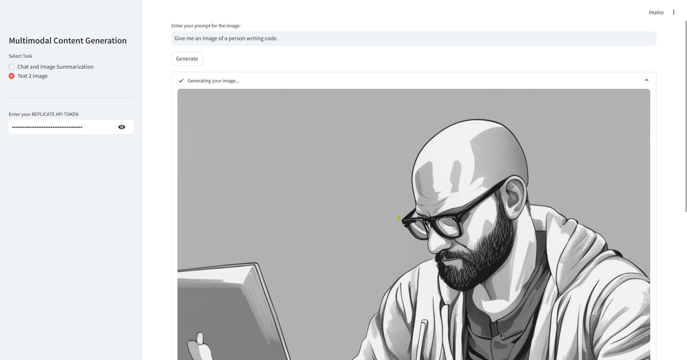

#  Multimodal Content Generation using LLMs and Vision Models

A full-stack multimodal AI application that combines **Natural Language Processing (NLP)**, **Computer Vision**, and **Text-to-Image Generation**. This project allows users to chat with an AI assistant, summarize images, and generate visuals from text using **Google Gemini** and **Stable Diffusion XL** via **Replicate API**.

---

## 🔑 Features

- **🗣️ Chat + Image Understanding**  
  Upload an image and interact with it via a conversational interface using **Gemini Pro Vision** + **Gemini 1.5 Pro**.

- **🎨 Text-to-Image Generation**  
  Create custom visuals by describing them in natural language. Powered by **Stable Diffusion XL** via Replicate.

- **⚙️ Configurable Parameters**  
  Tune image generation settings like resolution, denoising steps, prompt strength, and schedulers.

- **🖼️ Real-Time Streaming & UI**  
  Stream assistant responses token by token with **Streamlit**. Includes image upload, progress states, and memory.

---

## 🛠️ Tech Stack

| Category        | Tools |
|----------------|-------|
| 🔮 LLM & Vision | Google Gemini (`gemini-1.5-pro-latest`, `gemini-1.5-flash`) |
| 🎨 Image Gen    | Stable Diffusion XL via [Replicate](https://replicate.com/) |
| 🌐 Frontend     | Streamlit |
| 🖼️ Image Proc   | Pillow (PIL) |
| 🔐 Secrets      | python-dotenv |
| 📦 Env Mgmt     | Conda / pip |

---

## 🚀 Getting Started

### 1. Clone the Repository

```bash
git clone https://github.com/anujpatel1761/Multimodal-Content-Generation-using-LLMs.git
cd Multimodal-Content-Generation-using-LLMs
```

### 2. Set Up Environment for project

```bash
conda create -n multimodal-ai python=3.10
conda activate multimodal-ai
pip install -r requirements.txt
```

### 3. Configure API Keys

Create a `.env` file in the root folder:

```env
GOOGLE_API_KEY=google_api_key_here
REPLICATE_API_TOKEN=replicate_token_here
```

---

## ▶️ Run the App

```bash
streamlit run multi-modal-content-generation.py
```

Open the app at: `http://localhost:8501`

---

## 🖼️ UI Preview

> 📷 Screenshot of Text-to-Image Generation Mode:



---

## 🧪 Example Prompts

- **Text-to-Image:**  
  `Give me an image of a person writing code.`

- **Chat + Vision:**  
  Upload an image and ask:  
  `Describe what's happening in this image.`

---

## 💡 Future Enhancements

- Replace deprecated Gemini Vision model with `gemini-1.5-flash`
- Add multi-image upload support
- Improve image streaming performance

---


## 🙌 Acknowledgments

- [Google Generative AI](https://ai.google.dev/)
- [Replicate](https://replicate.com/)
- [Streamlit](https://streamlit.io/)
